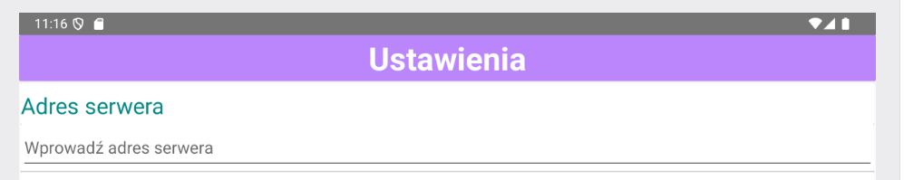

# DogMonitor - Aplikacja do monitorowania emocji psa

**DogMonitor** to aplikacja napisana w języku Kotlin, która umożliwia właścicielom psów monitorowanie emocji swoich pupili, na przykład podczas ich nieobecności w domu. Aplikacja łączy funkcję podglądu obrazu z kamery z analizą emocji psa, dostarczając w czasie rzeczywistym czytelnych informacji o jego stanie emocjonalnym.

## Główne funkcje aplikacji

### 1. Obserwacja psa przez kamerę
- Aplikacja umożliwia użytkownikowi oglądanie obrazu wideo przesyłanego z kamery.
- Obraz pochodzi z Raspberry Pi, które działa jako serwer, udostępniający strumień wideo w formacie MJPEG za pomocą adresu HTTP.
- W menu opcji użytkownik wprowadza adres URL kamery, np. `http://192.168.1.100:8080`, a obraz jest automatycznie wyświetlany w aplikacji.
- Dzięki temu użytkownik może na bieżąco obserwować zachowanie psa w czasie rzeczywistym.

### 2. Wyświetlanie emocji psa
- Aplikacja łączy się z serwerem odpowiedzialnym za analizę emocji psa za pomocą protokołu TCP/IP.
- Po uruchomieniu funkcji monitorowania aplikacja wysyła do serwera żądanie rozpoczęcia analizy (komenda `start_emotion`).
- Serwer, na podstawie danych (np. obrazu z kamery), analizuje emocje psa za pomocą zaawansowanego algorytmu.
- Wyniki analizy emocji są przesyłane z powrotem do aplikacji i prezentowane w formie prostych komunikatów tekstowych, takich jak:
  - `happy` (szczęśliwy)
  - `sad` (smutny)
  - `angry` (wściekły)
  - `relaxed` (zrelaksowany).
- Informacje o emocjach są wyświetlane na ekranie nad obrazem z kamery, co pozwala użytkownikowi jednocześnie obserwować psa i odczytywać jego emocje.

## Wymagania

- **Raspberry Pi** z kamerą do strumieniowania obrazu w formacie MJPEG.
- Serwer analizy emocji, który obsługuje protokół TCP/IP i potrafi analizować emocje psa na podstawie obrazu.

## Jak uruchomić aplikację?

1. Skonfiguruj Raspberry Pi do strumieniowania obrazu w formacie MJPEG i udostępnij adres HTTP.
2. Uruchom serwer analizy emocji, który przyjmuje żądania od aplikacji i przesyła wyniki analizy.
3. Wprowadź adres URL kamery w menu opcji aplikacji, oraz adres serwera w pliku MonitoringFragment.
4. Rozpocznij monitorowanie, aby na bieżąco obserwować psa i odczytywać jego emocje.

