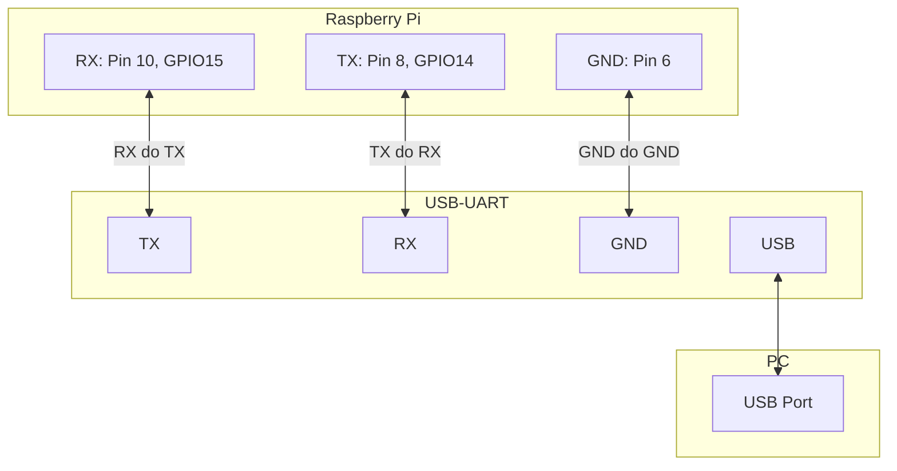
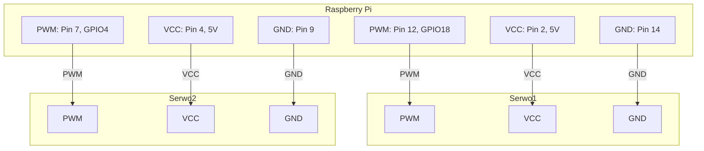

# Instrukcja projektu rpi

## Podłączenie


Adapter UART trzeba podłączyć do urządzenia w taki sposób:



> 🔌Należy najpierw podłączyć UART do rpi a dopiero później podłączyć do komputera!

Serwomechanizmy należy podłączyć do urządzenia w następujący sposób:

Serwo 1 - ruch kamerą na boki

Serwo 2 - ruch kamerą góra, dół



## Logowanie się do Raspberry Pi

> user: dog
> 
> pass: root

### Windows

Możliwe, że trzeba zainstalować najpierw sterowniki do adaptera UART.

1. Pobierz [PuTTY](https://www.chiark.greenend.org.uk/~sgtatham/putty/latest.html)

2. Otwórz PuTTY, wybierz **Serial**, wpisz port COM (np. COM3), i ustaw prędkość na **115200**

3. Kliknij Open i zaloguj się

### Mac/Linux

1. Otwórz terminal

2. Zaloguj się do raspberry pi komendą
   
   ```zsh
   screen $(ls /dev/tty.usbserial*) 115200
   ```

**2. Połączenie Raspberry Pi z Wi-Fi przez bash**

1. `sudo raspi-config`
2. System Options
3. Połącz się do swojego wifi

## Development

1. Pobierz SSH-FS do VSCode (extensions)

2. Wejdź w w niego na lewym pasku w VSCode (ikonka folderu)

3. Jeśli nie będzie konfiguracji `rpi` to kliknij ikonkę odświeżenia

4. W pliku `.vscode/configurations.json` zmień ip urządzenia (komenda `ip a` na raspberry)

5. Najeżdżając na konfigurację `rpi` kliknij w pierwszą ikonę *Add to workspace*

Niestety trzeba kopiować (dodawać pliki/foldery i ich zawartość). Po zakończeniu pracy skopiuj pliki do swojej maszyny i zrób commit!

> można ułatwić kopiowanie przez komendę scp


### O projekcie

Wszystkie moduły z dokumentacji są już zainstowane, na raspberry pi.
