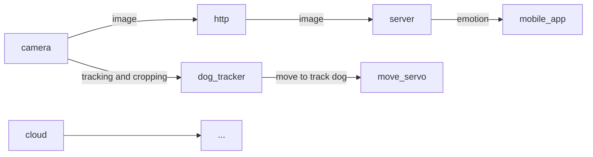
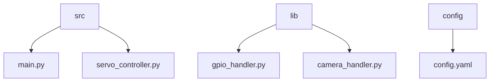

# **Architektura Systemu**

Projekt “Doggy Monitor” oparty jest na Raspberry Pi Zero, który zarządza kamerą oraz serwami obsługującymi gimbal. Cały system jest zaprojektowany, aby monitorować psa i przesyłać obraz do chmury w czasie rzeczywistym. Algorytmy do śledzenia ruchu psa umożliwiają automatyczne sterowanie serwami gimbala, aby utrzymać psa w kadrze.

## **Diagramy**

### Klasy

### **Przepływ danych**

## **Zastosowane technologie**

System działa na Raspberry Pi Zero, który jest odpowiedzialny za obsługę zarówno serw, jak i kamery. Do obsługi pinów oraz serwa wykorzystywane są biblioteki Python:

• **RPi.GPIO** – do zarządzania pinami GPIO na Raspberry Pi.

• **pigpio** – do precyzyjnego sterowania sygnałami PWM dla serw.

• **picamera2** – do obsługi kamery Raspberry Pi i przesyłania obrazu.

**Struktura plików projektu**

• `main.py`: Obsługa strumieniowania obrazu z kamery i śledzenia psa.

• `servo_controller.py`: Kod odpowiedzialny za sterowanie serwami.

• `gpio_handler.py`: Obsługa pinów GPIO.

• `camera_handler.py`: Integracja z kamerą.

• `config.yaml`: Plik konfiguracyjny systemu.
