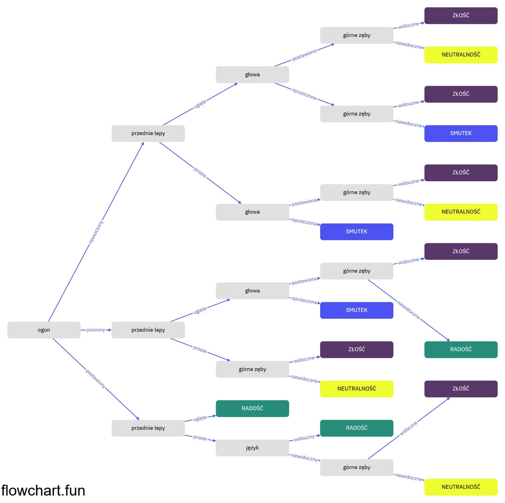
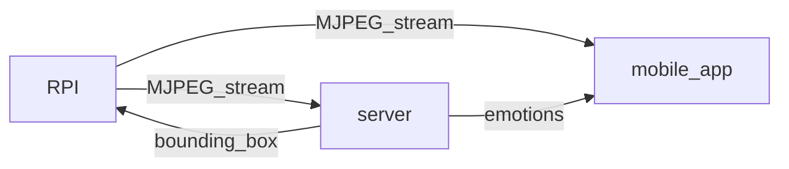
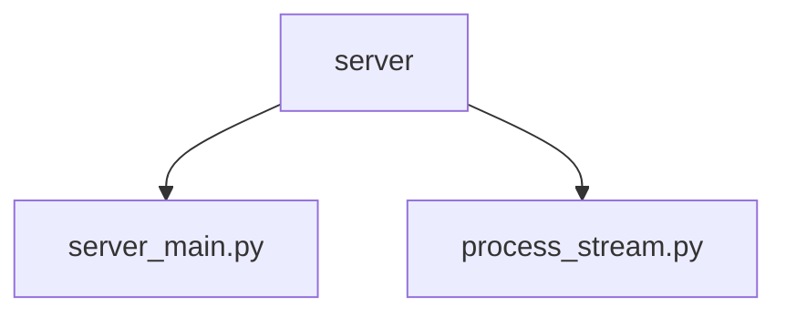

### Algorytm

Skrypt wstępnie przetwarza otrzymaną klatkę aby dostosować ją do używanego modelu sieci neuronowej. Następnie klatka zostaje przekazana do sieci i przeprowadzana jest inferencja.

Dane wynikowe z sieci dzielone są na bounding boxy, keypointsy oraz confidence score dla kazdego boxa i punktu. Następnie do algorytmu przekazywane są dane dla obiektu, którego confidence score jest największy. 

Algorytm oblicza kąty poszczególnych części ciała, o ile każdy z punktów należących do danej części ciała jest widoczny.

Na klatce następnie rysowany jest bounding box, a na podstawie wcześniej obliczonych kątów przypisywana jest pozycja poszczególnych części ciała psa.

Nastepnie dla ustalonych pozycji, przy pomocy drzewa decyzyjnego, przypisana zostaje psu konkretna emocja. 

Ostateczna emocja wyświetlana użytkownikowi determinowana jest na podstawie ostatnich 10 klatek. Cały skrypt zwraca klatkę z zaznaczonym bounding boxem, dane bounding boxa oraz emocję.

### Serwer

Serwer odbiera obraz w formacie strumienia MJPEG przesyłanego z kamery pod adresem HTTP. Następnie, korzystając z naszego modelu, wykrywa psa i wyznacza współrzędne środka bounding boxa, w której znajduje się pies. Te współrzędne są przesyłane do Raspberry Pi za pomocą połączenia TCP na porcie 8487. Na podstawie otrzymanych współrzędnych kamera, zamontowana na serwomechanizmach, jest sterowana przez algorytm działający na Raspberry Pi, co umożliwia śledzenie psa.

Serwer nasłuchuje port 5005 w oczekiwaniu na wiadomość o połączeniu się aplikacji mobilnej. Kiedy aplikacja wyśle wiadomość, serwer co sekundę wysyłą wykrywaną aktualnie emocje psa.

Serwer rejestruje każdą zmianę emocji psa i zapisuje ją, wraz z datą i godziną, do pliku txt.

### Inne

Folder inne zawiera pliki używane do testowania i tworzenia kodu serwera

### **Przepływ danych**

**Struktura plików**

• `server_main.py`: Wykrywa psa i jego emocje, przesyła dane do Raspberry Pi oraz obsługuje wysyłąnie emocji do aplikacji

• `process_stream.py`: Przetwarza klatki wideo, analizuje kluczowe punkty psa w celu określenia jego emocji, a także rysuje wyniki detekcji na obrazie.

Biblioteki zostały zapisane w [requirements.txt](./requirements.txt). 
